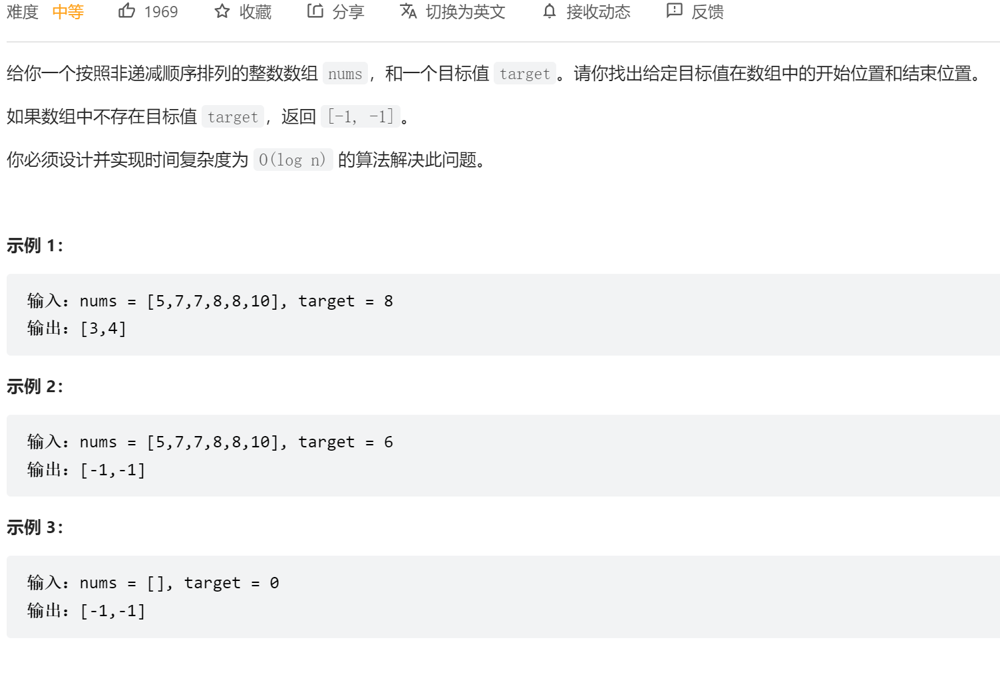

## [leetcode.34在排序数组中查找元素的第一个和最后一个位置(medium)](https://leetcode.cn/problems/find-first-and-last-position-of-element-in-sorted-array/)

描述：

- 

思路：二分法边界查找

```java
class Solution {
    public int[] searchRange(int[] nums, int target) {
    if(nums.length==0){
        return new int[]{-1,-1};
    }
     int left1=0;
     int right1=nums.length-1;
     int mid1;
     int leftIndex=0;
     int rightIndex=0;
     while(left1<=right1){
         mid1=left1+(right1-left1)/2;
         if(nums[mid1]==target){
            //  不同于普通版，普通版是返回mid值靠右边界的为此
            // 缩小边界
             left1=mid1+1;
         }else if(nums[mid1]>target){
             right1=mid1-1;
         }else if(nums[mid1]<target){
             left1=mid1+1;
         }
         if(left1-1<0){
             rightIndex=-1;
         }else{
             rightIndex=(nums[left1-1]==target)?left1-1:-1;
         }         
     }
     int left2=0;
     int right2=nums.length-1;
     int mid2=0;
     while(left2<=right2){
            mid2=left2+(right2-left2)/2;
            if(nums[mid2]==target){
                // 缩小边界
                right2=mid2-1;
            }else if(nums[mid2]<target){
                left2=mid2+1;
            }else if(nums[mid2]>target){
                right2=mid2-1;
            }
            if(left2==nums.length){
                leftIndex=-1;
            }else{
            leftIndex=(nums[left2]==target)?left2:-1;
            }
     }

     return new int[]{leftIndex,rightIndex};
    }
}
```

