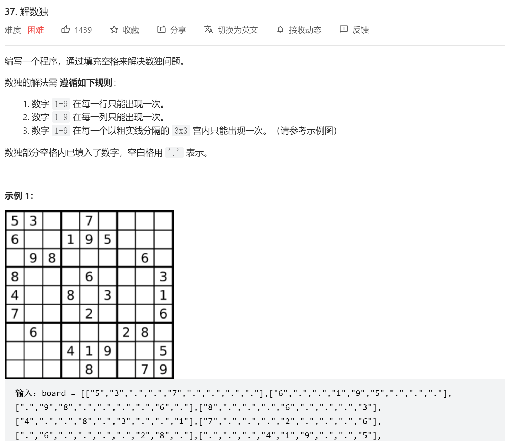

## [leetcode.37解数独(hard)](https://leetcode.cn/problems/sudoku-solver/)

描述：

- 

思路：回溯

```java
// 判断 board[i][j] 是否可以填入 n
boolean isValid(char[][] board, int r, int c, char n) {
    for (int i = 0; i < 9; i++) {
        // 判断行是否存在重复
        if (board[r][i] == n) return false;
        // 判断列是否存在重复
        if (board[i][c] == n) return false;
        // 判断 3 x 3 方框是否存在重复
        if (board[(r/3)*3 + i/3][(c/3)*3 + i%3] == n)
            return false;
    }
    return true;
}

void backtrack(char[][] board, int i, int j) {
    int m = 9, n = 9;
    if (j == n) {
        // 穷举到最后一列的话就换到下一行重新开始。
        backtrack(board, i + 1, 0);
        return;
    }
    
    // 如果该位置是预设的数字，不用我们操心
    if (board[i][j] != '.') {
        backtrack(board, i, j + 1);
        return;
    } 

    for (char ch = '1'; ch <= '9'; ch++) {
        // 如果遇到不合法的数字，就跳过
        if (!isValid(board, i, j, ch))
            continue;
        
        board[i][j] = ch;
        backtrack(board, i, j + 1);
        board[i][j] = '.';
    }
}

// 判断 board[i][j] 是否可以填入 n
boolean isValid(char[][] board, int r, int c, char n) {
    for (int i = 0; i < 9; i++) {
        // 判断行是否存在重复
        if (board[r][i] == n) return false;
        // 判断列是否存在重复
        if (board[i][c] == n) return false;
        // 判断 3 x 3 方框是否存在重复
        if (board[(r/3)*3 + i/3][(c/3)*3 + i%3] == n)
            return false;
    }
    return true;
}

```

